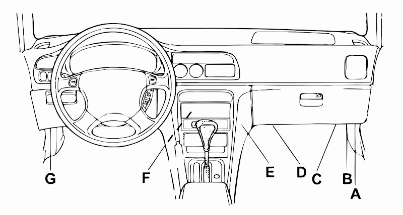

# '92-'01 Honda OBD Data Reader

## Table of Contents
- ['92-'01 Honda OBD Data Reader](#92-01-honda-obd-data-reader)
  - [Table of Contents](#table-of-contents)
  - [Introduction](#introduction)
  - [Data](#data)
  - [Requirements](#requirements)
  - [Installation](#installation)

## Introduction

This sketch demonstrates how to communicate with the Honda 3-pin diagnostic connector, commonly found in Honda vehicles manufactured between 1992 and 2001, to extract real-time data from the ECU.

## Data

The code reads and processes a variety of engine parameters. Below is a description of each variable and its significance and unit of measurement, followed by a table detailing the protocol commands and addresses tested on my '98 Civic with a D14A3 engine.

- **rpm**: Engine revolutions per minute  
- **speed**: Vehicle speed (Km/h)  
- **iat**: Intake Air Temperature (°C)  
- **ect**: Engine Coolant Temperature (°C)  
- **tps**: Throttle Position Sensor (%)  
- **o2**: Oxygen Sensor reading (raw voltage in 0–255)  
- **stf**: Short Term Fuel Trim (%)  
- **ltf**: Long Term Fuel Trim (%)  
- **ta**: Timing Advance (°)  
- **voltage**: ECU Voltage (V)  
- **imap**: Intake Manifold Absolute Pressure (kPa)

Below is a reference table for each data request:

| **Parameter**                                  | **Command** | **Address** | **Bytes to Read** | **Description**                                                                                                                                             |
|------------------------------------------------|------------:|------------:|-------------------:|-------------------------------------------------------------------------------------------------------------------------------------------------------------|
| **RPM**                                        | `0x20,0x05` |    `0x00`   |             `0x10` | Engine RPM (2-byte data). Formula: `((dlcdata[2] * 256) + dlcdata[3]) / 4`.                                                                                 |
| **Engine Coolant Temperature (ECT)**           | `0x20,0x05` |    `0x10`   |             `0x01` | Computed via a polynomial approximation, then offset by +40 to convert to °C.                                                                               |
| **ECU Voltage**                                | `0x20,0x05` |    `0x17`   |             `0x01` | Raw byte scaled by `1/10.45` to determine voltage (in volts).                                                                                               |
| **Short Term Fuel Trim (STF)**                 | `0x20,0x05` |    `0x20`   |             `0x01` | Percentage indicating short-term fuel correction.                                                                                                           |
| **Long Term Fuel Trim (LTF)**                  | `0x20,0x05` |    `0x22`   |             `0x01` | Percentage indicating long-term fuel correction.                                                                                                            |
| **Intake Manifold Absolute Pressure (IMAP)**   | `0x20,0x05` |    `0x12`   |             `0x01` | Raw byte scaled by `0.716`, offset by `-5` to convert to kPa.                                                                                               |
| **Vehicle Speed**                              | `0x20,0x05` |    `0x02`   |             `0x01` | Vehicle speed in km/h (assumed 1:1 from raw byte).                                                                                                          |
| **Intake Air Temperature (IAT)**               | `0x20,0x05` |    `0x11`   |             `0x01` | Similar polynomial to ECT, then offset by +40 to convert to °C.                                                                                             |
| **Timing Advance (TA)**                        | `0x20,0x05` |    `0x26`   |             `0x01` | Formula: `((dlcdata[2] - 24) / 2) + 128`. Represents degrees of ignition advance.                                                                            |
| **Throttle Position Sensor (TPS)**             | `0x20,0x05` |    `0x14`   |             `0x01` | 0% = 25 raw value, 100% = 233 raw value. Computed by `(dlcdata[2] - 25) / 2.08`, clamped to non-negative.                                                    |
| **Oxygen Sensor (O2)**                         | `0x20,0x05` |    `0x15`   |             `0x01` | O2 sensor reading in a 0–255 scale (approx. 0–1 V or 0–5 V, depending on the ECU).                                                                           |

## Requirements

1. **Honda 3-Pin OBD Port**  

   - The 3-pin DLC diagnostics data connector (blue; older versions ‘92–‘95 may be gray or yellow) is usually inserted in a protective rubber (green or blue) sleeve together with a 2-pin SCS connector. Both connectors might appear together in one protective sleeve.

  
       

   - The 2-pin connector is a **SCS service check connector** for self-diagnostics, **not** for data transmission.  
   - You must locate the standard Honda 3-pin diagnostic connector in your vehicle, which is often found near the passenger-side kick panel or underneath the dashboard.  
  
     

2. **Arduino Board**  
   - This code has been tested with a typical Arduino UNO. Make sure you have a free digital pin to handle half-duplex communication (pin 11 in this code).

3. **Libraries**  
   - [SoftwareSerialWithHalfDuplex](https://github.com/nickstedman/SoftwareSerialWithHalfDuplex).

4. **Connections/Wiring**  
   - Pin **11** on the Arduino is used for both RX and TX (half-duplex).  
   - Proper grounding between the ECU and Arduino is critical.  
   - A level shifter or special circuitry may be required, depending on ECU voltage levels.

## Installation

1. **Library Setup**  
   - Install the **SoftwareSerialWithHalfDuplex** library. You can place the library folder inside your Arduino `libraries/` directory or install via Arduino Library Manager if available.

2. **Open the Sketch**  
   - Copy the provided code into a new Arduino sketch file or clone your repository containing this code.

3. **Adjust Pin Assignments (If Needed)**  
   - By default, pin **11** is used for both RX and TX with half-duplex mode.  
   - Ensure the pin is free and not used by other peripherals in your Arduino setup.

4. **Compile and Upload**  
   - Connect your Arduino to the computer via USB.  
   - Select the correct Arduino board and COM port in the Arduino IDE.  
   - Click **Verify** then **Upload**.

5. **View Data**  
   - Open the Arduino Serial Monitor at **115200 baud**.  
   - You should see CSV-like output printing the values for RPM, ECT, Voltage, etc.  
   - If everything is connected properly, the parameters will update in real time.
   - *A graphical user interface (GUI) is planned for future development to provide a more user-friendly experience. <3*
---

**Enjoy monitoring your Honda data!** Feel free to modify the code for other parameters or to adjust the formulas to match different sensor curves.